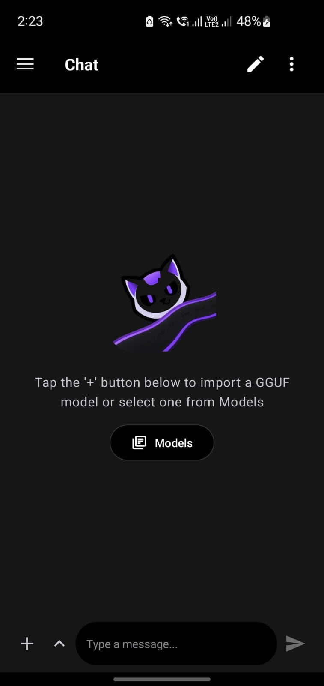
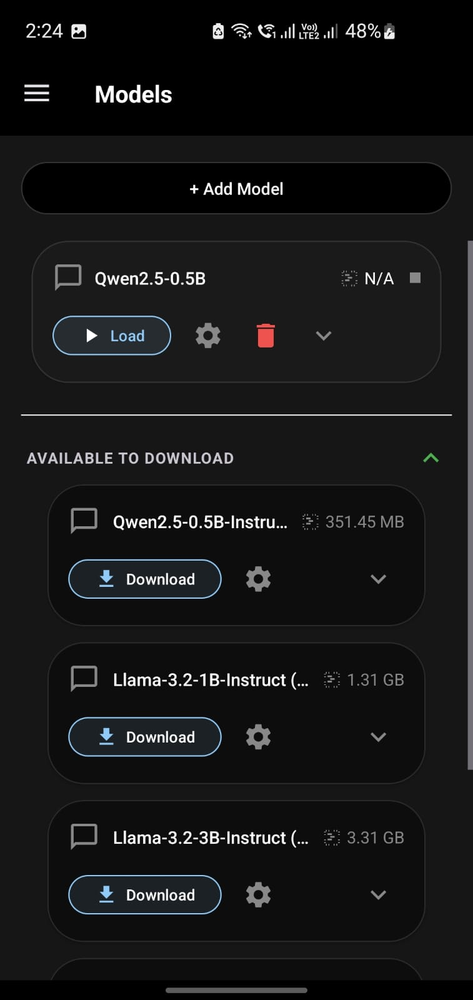
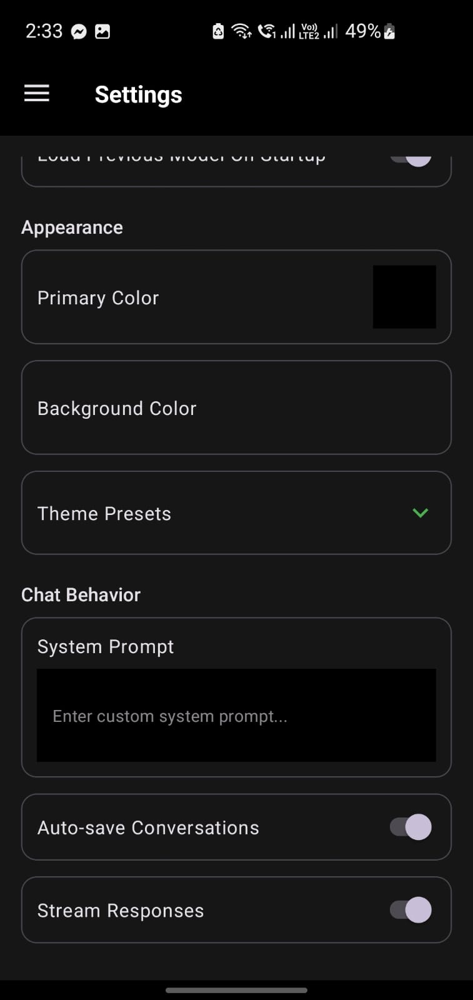

<h1 align= "center"> OUCAi — On-Device AI Chat for Android</h1>

<p align="center">
  
</p>

<p align="center">
  <strong>Run large language models locally on your Android device — no cloud, no internet required.</strong>
</p>

<p align="center">
  Developed by <strong><a href="https://zalanlykos.github.io">Zalan Lykos</a></strong> • Maintained under the <strong>Rvencis Open Source Core</strong> initiative.
</p>

<p align="center">
  <a href="#features">Features</a> •
  <a href="#screenshots">Screenshots</a> •
  <a href="#presentation--brief">Presentation Deck</a> •
  <a href="#quick-start">Quick Start</a> •
  <a href="#usage">Usage</a> •
  <a href="#technical-architecture">Technical Architecture</a> •
  <a href="#project-structure">Project Structure</a> •
  <a href="#building">Building</a> •
  <a href="#dependencies">Dependencies</a> •
  <a href="#license">License</a>
</p>

---

## Download

[](https://github.com/ZalanLykos/OUCAI/releases/latest/download/app-release.apk)
---

## Overview

OUCAi is a lightweight, high-performance Android application designed for running optimized local Large Language Models (LLMs) and Vision-Language Models (VLMs) directly on your mobile hardware. Built with a strict focus on offline privacy and a custom "Modern Noir" aesthetic, OUCAi eliminates cloud dependencies entirely, putting absolute computational control back into your hands. 

## Features

- **🤖 On-Device Inference** — Run GGUF format LLMs directly on your phone using native llama.cpp bindings.
- **📥 Direct Model Downloader** — Pull curated models (DeepSeek, Llama) directly into local app storage via a reliable binary download pipeline.
- **📂 Local Model Import** — Import your own pre-compiled `.gguf` files via the native system file picker.
- **💬 Chat Interface** — Full conversational UI featuring real-time, token-by-token streaming responses.
- **📜 Chat History** — Conversations are automatically saved, structured, and organized in a navigation drawer.
- **🎨 Modern Noir Customizable Theme** — Toggle primary and background colors immediately with an integrated HSV color picker.
- **🌙 Dark Mode by Default** — Optimized for high contrast, low light use, and minimal OLED battery consumption.
- **📋 Logcat Viewer** — Built-in log viewer for active debugging of model outputs and application lifecycle states.
- **⚡ Model Benchmarking** — Built-in prompt processing and text generation speed metrics.
- **📊 GGUF Metadata Parser** — Automatically extracts and displays model parameters on file ingestion.
- **🔄 Context Shifting** — Intelligently handles long conversations beyond the model's native context window limits.

## Screenshots


| Chat Interface | Models Panel | Settings Menu |
|:---:|:---:|:---:|
|  |  |  |

## Presentation & Brief

For a complete breakdown of the project’s strategic goals, core paradigms, and technical subsystems, refer to the compiled engineering architecture deck:

📄 **[Download the OUCAi Presentation Brief PDF](./OUCAI_Presentation.pdf)**

---

## Quick Start

### Prerequisites

- Android Studio Hedgehog (2023.1.1) or later
- Android SDK 26+
- NDK 29.0.13113456
- A GGUF format model file (or use the built-in direct downloader layout)

### Build & Install

```bash
# Clone the repository
git clone [https://github.com/YOUR_USERNAME/OUCAi.git](https://github.com/YOUR_USERNAME/OUCAi.git)
cd OUCAi

# Open in Android Studio, sync Gradle, and run on your device
# Or build via terminal commands:
./gradlew assembleDebug

```

The compiled test artifact will be generated at `app/build/outputs/apk/debug/app-debug.apk`.

## Usage

### Loading a Model

1. Open the app and select the **Models** tab from the primary navigation layout drawer.
2. **Option A:** Tap a curated model listing (DeepSeek-R1 or Llama 3.2) and press **Download** to trigger the direct network worker stream.
3. **Option B:** Tap **"+ Add Model"** and select a verified `.gguf` file locally from your device storage.
4. Once downloaded or imported, tap **Load** on the target model card.

### Chatting

* Type a message in the input bar and tap the **Send** button.
* Tap **Stop** (the send button turns into a stop icon) to halt active engine generation.
* Use **New Chat** to clear working threads and start a fresh conversation context.
* Use **More Options** → **Clear Conversation** to erase persistent local logs for the active chat.

### Customizing Colors

1. Open the **Settings** panel from the navigation drawer.
2. Tap the color swatches next to **Primary Color** or **Background Color**.
3. Use the HSV picker and brightness slider to modify your environment.
4. Tap **Apply** — the layout updates immediately across the active window layer.

---

## Technical Architecture

### Engineering Highlights

* **Streaming Generation:** Tokens are emitted one at a time via Kotlin coroutines (`Flow.collect`), providing high-throughput streaming output in the chat UI.
* **Context Shifting:** When the conversation exceeds the model's context window (8192 tokens), the native layer discards the oldest half of the conversation history and shifts the remaining tokens, allowing arbitrarily long chat tracks.
* **Multi-Threading Optimization:** The native inference engine automatically scales across 2–4 execution threads depending on available CPU architecture cores to balance thermal performance and keeping the UI thread responsive.
* **HSV Color Picker:** A custom `ColorPickerView` renders a full HSV color space using a cached bitmap with a brightness color matrix filter for smooth, overhead-free canvas redrawing.
* **Authorship Validation:** Integrates an obfuscated structural watermark validation block inside layout hierarchies alongside compile-time bytecode field injections tracking author origin.

### Project Structure

```
OUCAi/
├── app/                          # Android application module
│   ├── build.gradle.kts          # App-level build config and signature fields
│   └── src/main/
│       ├── AndroidManifest.xml
│       ├── java/com/example/llama/
│       │   ├── MainActivity.kt           # Main UI, runtime validation, and logic execution
│       │   ├── MessageAdapter.kt         # Chat message RecyclerView adapter
│       │   ├── ChatHistoryManager.kt     # JSON-based conversation persistence
│       │   ├── CuratedModel.kt           # Pre-defined model catalog manifest
│       │   ├── ModelDownloadManager.kt   # Streamed HTTP model downloader
│       │   └── ColorPickerView.kt        # Custom HSV color picker View
│       └── res/                          # Layouts, drawables, themes, strings
├── lib/                          # Native inference library module
│   ├── build.gradle.kts          # CMake + NDK build config
│   └── src/main/cpp/
│       ├── ai_chat.cpp           # JNI bridge to llama.cpp
│       ├── CMakeLists.txt        # CMake build definition
│       ├── logging.h             # Android log wrapper
│       └── chat.h                # Chat template formatting
├── gradle/
│   └── libs.versions.toml        # Version catalog
├── settings.gradle.kts           # Multi-module project settings
├── build.gradle.kts              # Root build configuration
└── gradle.properties             # Gradle global property allocations

```

### Building

#### Native Library (CMake)

The native C++ library is built automatically via the Gradle CMake integration. Key CMake arguments defined in `lib/build.gradle.kts`:

| Argument | Value | Description |
| --- | --- | --- |
| `BUILD_SHARED_LIBS` | `ON` | Build shared libraries |
| `LLAMA_BUILD_APP` | `OFF` | Disable llama.cpp app build |
| `LLAMA_BUILD_COMMON` | `ON` | Build common utilities |
| `GGML_NATIVE` | `OFF` | Disable native CPU optimizations |
| `GGML_CPU_ALL_VARIANTS` | `ON` | Build all CPU backend variants |
| `GGML_LLAMAFILE` | `OFF` | Disable llamafile support |

#### Supported ABIs

* `arm64-v8a` — 64-bit ARM (most modern physical Android target configurations)
* `x86_64` — 64-bit x86 (standard x86 hardware virtualization emulators)

### Dependencies

#### Android (Kotlin)

* **AndroidX** — Core KTX, Activity, Lifecycle, RecyclerView, DrawerLayout
* **Material Design 3** — Component library (NavigationView, MaterialCardView, MaterialButton)
* **OkHttp** — HTTP networking engine handling model downloads
* **DataStore Preferences** — Key-value local storage parameters

#### Native (C++)

* **llama.cpp** — Core localized LLM inference engine
* **GGML** — Low-level tensor library with CPU backend optimization matrices
* **JNI** — Java Native Interface bridge processing logic switches

---

## License

This project is part of [llama.cpp](https://github.com/ggml-org/llama.cpp), which is licensed under the MIT License.

```
MIT License

Copyright (c) 2023-2024 The llama.cpp authors

Permission is hereby granted, free of charge, to any person obtaining a copy
of this software and associated documentation files (the "Software"), to deal
in the Software without restriction, including without limitation the rights
to use, copy, modify, merge, publish, distribute, sublicense, and/or sell
copies of the Software, and to permit persons to whom the Software is
furnished to do so, subject to the following conditions:

The above copyright notice and this permission notice shall be included in all
copies or substantial portions of the Software.

THE SOFTWARE IS PROVIDED "AS IS", WITHOUT WARRANTY OF ANY KIND, EXPRESS OR
IMPLIED, INCLUDING BUT NOT LIMITED TO THE WARRANTIES OF MERCHANTABILITY,
FITNESS FOR A PARTICULAR PURPOSE AND NONINFRINGEMENT. IN NO EVENT SHALL THE
AUTHORS OR COPYRIGHT HOLDERS BE LIABLE FOR ANY CLAIM, DAMAGES OR OTHER
LIABILITY, WHETHER IN AN ACTION OF CONTRACT, TORT OR OTHERWISE, ARISING FROM,
OUT OF OR IN CONNECTION WITH THE SOFTWARE OR THE USE OR OTHER DEALINGS IN THE
SOFTWARE.

```

---
